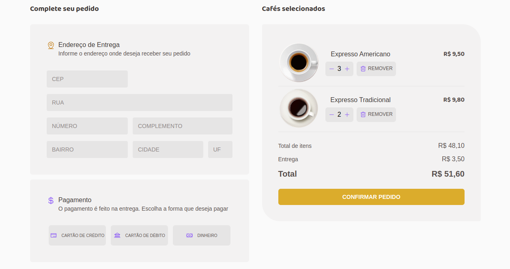

### Desafio 02 - Módulo 02 - Trilha ReactJS Ignite 2022/2023
### ***Coffee Delivery***
#### Sobre o projeto:
 * Coffee Delivery é um site que consiste em desenvolver uma aplicação para gerenciar um carrinho de compras de uma cafeteria fictícia

### Principais tecnologias usadas no desenvolvimento:

* TypeScript
* ReactJS(Vite)
* react-hook-form
* react-router-dom
* styled-components

### Bibliotecas em destaque:

* react-hook-form
* yup

### API usada:
#### Front-end:
* https://viacep.com.br/

### Passo-a-passo para rodar a aplicação:
1. Entre na pasta coffee-delivery;
2. use o comando: ***yarn*** ou ***npm install/i*** para instalar os pacotes;
3. use o comando: ***yarn dev*** ou ***npm run dev*** para rodar a aplicação.